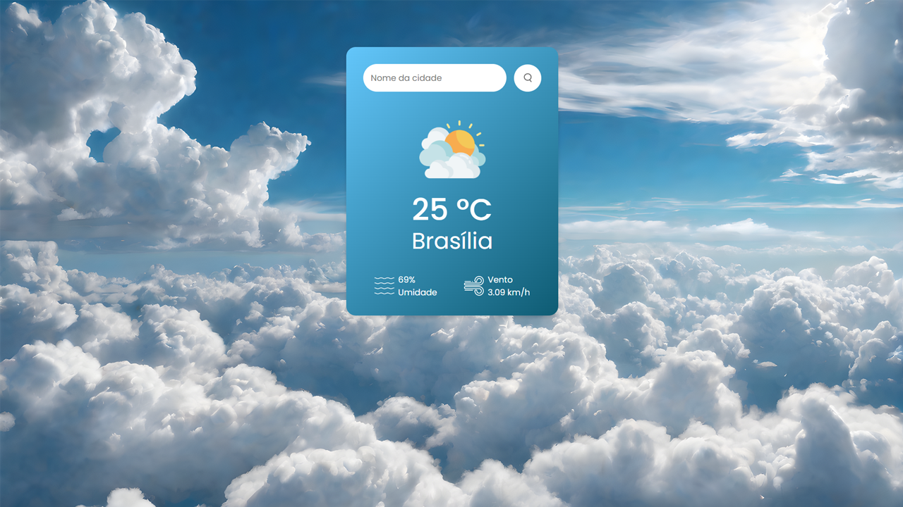

  

# ⛅ Weather App
Projeto de um aplicativo que mostra o clima atual de qualquer cidade do planeta, basta digitar o nome da cidade que o app irá fazer a requisição e atualizar os dados.

- Veja o projeto: [Live Preview](https://victtor-simple-weather-app.vercel.app/)

## ⚙️ Funcionalidades

- [x] Mostra o clima de qualquer cidade do mundo;
- [x] Site com design simples e totalmente responsivo;
- [x] Puxa os dados atualizados através de uma API;

## 🚀 Tecnologias

- [HTML](https://www.w3schools.com/html/)
- [CSS](https://developer.mozilla.org/pt-BR/docs/Web/CSS)
- [JavaScript](https://developer.mozilla.org/pt-BR/docs/Web/JavaScript)
- [API REST](https://www.redhat.com/pt-br/topics/api/what-is-a-rest-api)

## 📝 Considerações

Projeto simples feito para práticar meus conhecimento em funções assincronas e requisições em API's. Pretendo fazer uma versão melhor no futuro que salva as cidades buscadas e que o background muda de acordo com o clima;
